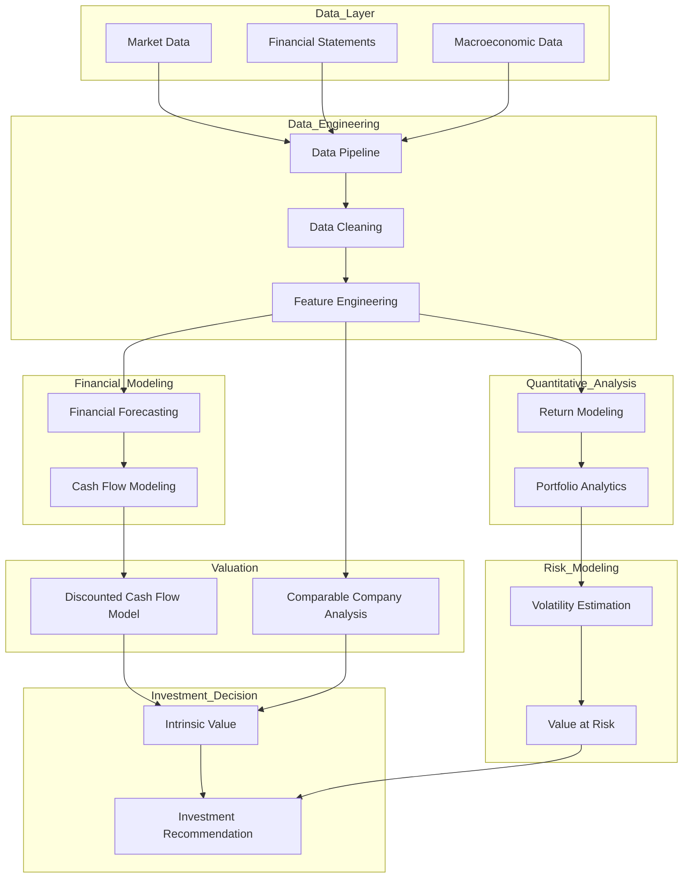
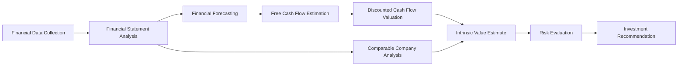

# CFA Research Challenge – Quantitative Equity Valuation System

This repository implements a *quantitative equity research platform* designed to replicate the workflow followed in professional investment analysis and the *CFA Institute Research Challenge*.

The project integrates *financial modeling, valuation methodologies, quantitative finance techniques, and risk analysis* into a unified Python framework. The objective is to build a *reproducible system that estimates the intrinsic value of a publicly traded company while supporting data-driven investment decisions*.

The platform follows the analytical process typically used by *equity research analysts*:

1. Collecting financial data  
2. Constructing financial forecasts  
3. Estimating free cash flows  
4. Performing valuation using multiple approaches  
5. Evaluating investment risk  

---

## Project Objective

Professional investment research relies on *structured financial analysis combined with rigorous valuation models*. This repository demonstrates how the traditional equity research workflow can be *implemented programmatically using Python*.

The system allows analysts to transform *raw financial data into investment insights* through a modular architecture that includes:

- Data engineering pipelines  
- Financial modeling tools  
- Valuation modules  
- Quantitative analysis methods  
- Risk evaluation models  

By integrating these components, the project provides a *practical implementation of institutional-style investment research*, enabling reproducible, transparent, and scalable equity analysis.

## System Architecture

The system follows a *layered architecture* similar to modern quantitative research frameworks such as *FinRL*, separating data ingestion, financial modeling, valuation, quantitative analysis, and risk modeling into independent modules.

This modular design allows each component of the research workflow to be developed, tested, and extended independently while contributing to a unified investment analysis pipeline.

The architecture separates *data processing, financial modeling, valuation, quantitative analysis, and decision generation*, allowing each component to operate independently while contributing to the final *investment recommendation and intrinsic value estimation*.

## Repository Structure

The repository is organized to clearly separate *research experimentation* from *reusable financial modeling code*.

    CFA_Research_Challenge

    notebooks
    exploratory financial analysis
    valuation experiments
    research prototypes

    src
    data_pipeline
        financial data ingestion
        preprocessing and feature engineering

    financial_model
        financial statement forecasting
        revenue modeling
        free cash flow projections

    comparables
        peer group analysis
        valuation multiples
        market benchmarking

    quant
        statistical return modeling
        portfolio analytics
        factor analysis

    risk
        volatility modeling
        value-at-risk estimation
        risk-adjusted performance metrics

## Investment Research Workflow

The workflow implemented in this repository mirrors the *analytical process followed by professional equity research teams*.

### 1. Data Collection
The analysis begins with collecting *financial statement data, market data, and macroeconomic indicators*.  
These datasets form the foundation for all subsequent financial and quantitative analysis.

### 2. Data Processing
Raw datasets are cleaned, validated, and transformed using the data pipeline.  
Feature engineering techniques are applied to create structured inputs suitable for financial modeling.

### 3. Financial Forecasting
Using processed financial data, the system constructs *forward-looking financial projections*, including revenue forecasts, operating margins, and capital expenditures.

### 4. Cash Flow Estimation
Projected financial statements are used to estimate *Free Cash Flow (FCF)*, which represents the cash generated by the business after accounting for operating expenses and capital investments.

### 5. Valuation Modeling
Two primary valuation approaches are implemented:

- *Discounted Cash Flow (DCF)* valuation using projected free cash flows  
- *Comparable Company Analysis (Comps)* using industry valuation multiples

These models provide estimates of the company’s *intrinsic value* relative to market pricing.

### 6. Quantitative Analysis
Statistical models analyze *return distributions, market behavior, and factor exposure*, providing deeper insights into the financial characteristics of the asset.

### 7. Risk Modeling
Risk modules estimate *volatility, downside risk, and risk-adjusted performance metrics*, including measures such as Value at Risk (VaR).

### 8. Investment Assessment
The final stage integrates *valuation outputs and risk metrics* to produce an overall *investment assessment*, supporting data-driven equity research conclusions.

## Mathematical Foundations

The valuation and quantitative models implemented in this repository are grounded in *established financial theory*.

---

### Asset Returns

Asset returns are calculated using the standard *price return formulation*.

$$
\begin{aligned}
R_t &= \frac{P_t - P_{t-1}}{P_{t-1}}
\end{aligned}
$$

where:

- \(P_t\) : asset price at time \(t\)

---

### Free Cash Flow to the Firm (FCFF)

Free Cash Flow to the Firm represents the *cash available to all providers of capital*.

$$
\begin{aligned}
FCFF &= EBIT(1 - T) \\
     &\quad + Depreciation \\
     &\quad - CapEx \\
     &\quad - \Delta WC
\end{aligned}
$$

where:

- *EBIT* : Earnings before interest and taxes  
- *T* : Corporate tax rate  
- *CapEx* : Capital expenditures  
- *ΔWC* : Change in working capital  

---

### Discounted Cash Flow (DCF) Valuation

The *enterprise value of a firm* is estimated as the present value of projected free cash flows.

$$
\begin{aligned}
EV &= \sum_{t=1}^{n} \frac{FCFF_t}{(1 + WACC)^t}
     + \frac{TV}{(1 + WACC)^n}
\end{aligned}
$$

where:

- *WACC* : Weighted Average Cost of Capital  
- *TV* : Terminal Value  
- *n* : Forecast horizon  

---

### Portfolio Risk

Portfolio variance is computed using the *covariance matrix of asset returns*.

$$
\begin{aligned}
\sigma_p^2 &= w^{T}\Sigma w
\end{aligned}
$$

where:

- *w* : vector of portfolio weights  
- *Σ* : covariance matrix of asset returns  

---

## Applications

The framework developed in this repository can be applied to several financial analysis tasks, including:

- Equity research modeling  
- Corporate valuation analysis  
- Portfolio construction and optimization  
- Quantitative finance experimentation  

It can also serve as a *practical tool for preparing for investment competitions* such as the *CFA Institute Research Challenge*.

---

## Future Extensions

The platform can be further expanded to include:

- *Monte Carlo valuation simulations*
- *Macroeconomic factor modeling*
- *Reinforcement learning trading systems*
- *Automated equity research report generation*

These extensions would transform the repository into a *comprehensive quantitative investment research platform* capable of supporting advanced financial modeling and investment strategy development.
