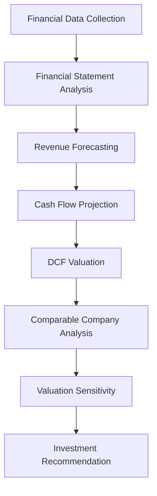
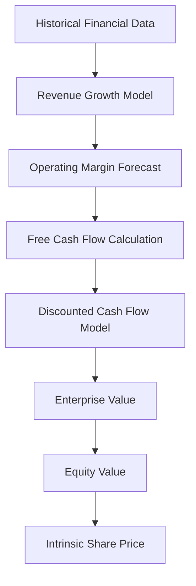

# Financial Valuation Notebooks

Interactive Research Notebooks for Equity Valuation and Investment Analysis

---

# Overview

The **notebooks module** contains a collection of **interactive financial analysis notebooks** used to perform company valuation and investment research.

These notebooks replicate the workflow used by professional **equity research analysts** and participants in the **CFA Research Challenge**.

The notebooks provide step-by-step implementation of:

- financial data exploration
- revenue and earnings forecasting
- discounted cash flow valuation
- comparable company analysis
- valuation sensitivity testing
- investment recommendation generation

Each notebook serves as a **research workspace** where financial models can be tested, modified, and validated.

---

# Core Idea

Equity valuation aims to estimate the **intrinsic value of a company** using financial data and forecasting models.

The notebooks follow a structured workflow:

1. Load financial statements and market data
2. Analyze historical financial performance
3. Forecast future revenues and operating margins
4. Estimate Free Cash Flow to Firm (FCFF)
5. Compute enterprise value using a DCF model
6. Perform comparable company valuation
7. Derive a final investment recommendation

The goal is to determine whether the stock is **undervalued or overvalued relative to market price**.

---

# Notebook Workflow

The research workflow implemented in the notebooks follows the typical **equity research pipeline**.

---

# Financial Valuation Framework

The notebooks implement a **multi-stage valuation framework**.

---

# Mathematical Foundations

## Free Cash Flow to Firm (FCFF)

Free Cash Flow to the Firm represents the cash available to all capital providers.

\[
FCFF = EBIT(1 - T) + Depreciation - CapEx - \Delta WC
\]

Where:

- \(EBIT\) = earnings before interest and taxes  
- \(T\) = corporate tax rate  
- \(CapEx\) = capital expenditures  
- \(\Delta WC\) = change in working capital  

---

## Discounted Cash Flow Model

The enterprise value of the firm is calculated as the present value of projected free cash flows.

\[
EV = \sum_{t=1}^{n} \frac{FCFF_t}{(1 + WACC)^t} + \frac{TV}{(1 + WACC)^n}
\]

Where:

- \(EV\) = enterprise value  
- \(FCFF_t\) = free cash flow in year \(t\)  
- \(WACC\) = weighted average cost of capital  
- \(TV\) = terminal value  

---

## Weighted Average Cost of Capital

\[
WACC = \frac{E}{D + E}R_e + \frac{D}{D + E}R_d (1 - T)
\]

Where:

- \(E\) = market value of equity  
- \(D\) = market value of debt  
- \(R_e\) = cost of equity  
- \(R_d\) = cost of debt  

WACC represents the **required return expected by investors**.

---

## Terminal Value

To capture cash flows beyond the forecast horizon, the **Gordon Growth Model** is used.

\[
TV = \frac{FCFF_{n+1}}{WACC - g}
\]

Where:

- \(g\) = perpetual growth rate

Terminal value typically accounts for a **significant portion of total firm valuation**.

---

# Key Objectives of the Notebooks

The notebooks aim to provide:

### Financial Data Exploration

Understanding historical performance through financial statement analysis.

### Forecasting Models

Estimating future revenues, margins, and cash flows.

### Valuation Models

Implementing Discounted Cash Flow (DCF) and relative valuation techniques.

### Scenario Analysis

Evaluating how valuation changes under different assumptions.

### Investment Decision Support

Generating **Buy / Hold / Sell recommendations** based on intrinsic value estimates.

---

# Applications

These notebooks can be used for:

- equity research projects  
- CFA Research Challenge preparation  
- financial modeling practice  
- investment strategy development  
- academic finance research  

---

# Expected Output

Running the notebooks produces:

- projected financial statements  
- intrinsic enterprise value  
- equity valuation estimates  
- price targets  
- valuation sensitivity charts  

These outputs support **data-driven investment decisions**.
