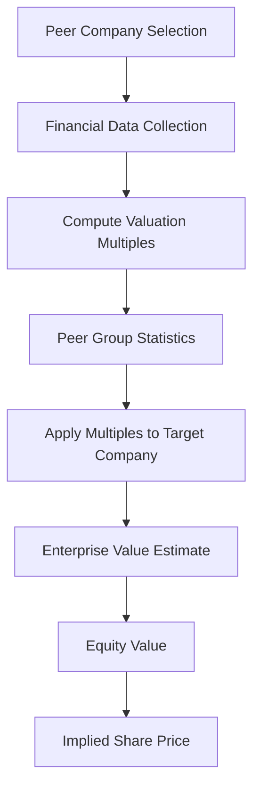
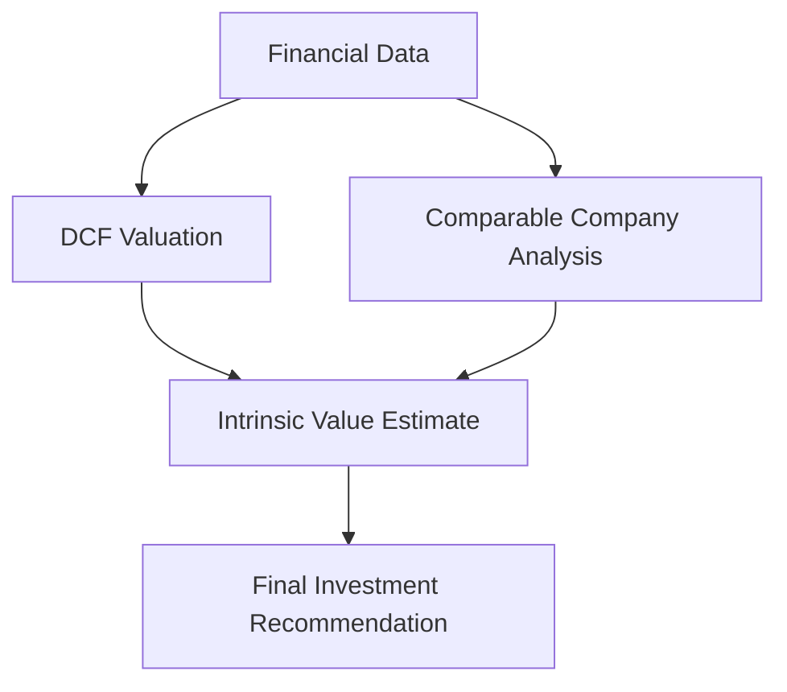

# Comparable Company Valuation Module

Relative Valuation Framework for Equity Research

---

# Overview

The *comparables module* implements *Comparable Company Analysis (CCA)*, a widely used valuation technique in equity research and investment banking.

Instead of estimating intrinsic value from cash flows, this approach values a company by comparing it to *similar publicly traded firms (peer companies)* using valuation multiples.

By analyzing how similar companies are priced in the market, analysts can estimate the *fair value of the target company*.

This method is frequently used alongside *Discounted Cash Flow (DCF)* to validate valuation results.

---

# Core Idea

Comparable company analysis assumes that *similar companies should trade at similar valuation multiples*.

The valuation process follows these steps:

1. Identify a set of *peer companies* in the same industry
2. Collect financial metrics for each company
3. Compute valuation multiples
4. Calculate the *industry average multiple*
5. Apply the multiple to the target company’s financial metric
6. Estimate *enterprise value and equity value*

This approach provides a *market-based valuation benchmark*.

---

# Valuation Workflow

---
# Mathematical Foundations

## Enterprise Value

Enterprise value represents the total value of the firm's operating assets.

$$
EV = Market\ Cap + Total\ Debt - Cash
$$

Where:

- $EV$ = enterprise value  
- $Market\ Cap$ = market capitalization of equity  
- $Total\ Debt$ = short-term and long-term debt  
- $Cash$ = cash and cash equivalents  

---

## EV / EBITDA Multiple

One of the most widely used valuation multiples is **EV/EBITDA**.

$$
EV/EBITDA = \frac{EV}{EBITDA}
$$

Where:

- $EBITDA$ = Earnings Before Interest, Taxes, Depreciation, and Amortization  

This multiple allows comparison between firms with **different capital structures**, since enterprise value includes debt while EBITDA excludes financing costs.

---

## Price-to-Earnings Ratio

Another commonly used valuation metric is the **P/E ratio**.

$$
P/E = \frac{P}{EPS}
$$

Where:

- $P$ = market price per share  
- $EPS$ = earnings per share  

This multiple reflects how much investors are willing to pay for each unit of earnings.

---

## Enterprise Value from Comparable Multiples

Once the **peer group multiple** is determined, it can be applied to the target company.

$$
EV_{target} = Multiple_{industry} \times Metric_{target}
$$

Example using EV/EBITDA:

$$
EV_{target} = (EV/EBITDA)_{peer} \times EBITDA_{target}
$$

---

## Equity Value

After estimating enterprise value, the **equity value** is computed as:

$$
Equity\ Value = EV - Net\ Debt
$$

Where:

$$
Net\ Debt = Total\ Debt - Cash
$$

---

## Intrinsic Share Price

Finally, the **implied share price** is calculated as:

$$
Price = \frac{Equity\ Value}{Shares\ Outstanding}
$$

This represents the **valuation estimate derived from peer company multiples**.

---

# Common Valuation Multiples

Comparable analysis often uses several valuation ratios, including:

| Multiple | Formula | Usage |
|--------|--------|--------|
| EV / EBITDA | Enterprise Value / EBITDA | Widely used across industries |
| EV / Revenue | Enterprise Value / Revenue | Used for high-growth companies |
| P / E | Price / Earnings | Common equity valuation metric |
| P / B | Price / Book Value | Used for financial institutions |

Different sectors use different multiples depending on their *business model and financial characteristics*. :contentReference[oaicite:1]{index=1}

---

# Module Responsibilities

The *comparables module* performs the following tasks.

---

### Peer Company Selection

Identifies companies operating in the *same industry or market segment*.

This ensures that valuation comparisons are meaningful.

---

### Financial Data Aggregation

Collects key financial metrics for each peer company, including:

- market capitalization
- revenue
- EBITDA
- net income
- enterprise value

---

### Multiple Computation

Calculates valuation ratios such as:

- EV / EBITDA
- EV / Revenue
- P / E

These metrics describe how the market values similar firms.

---

### Peer Group Benchmarking

The module computes *summary statistics* such as:

- mean multiples
- median multiples
- valuation ranges

These statistics provide a benchmark for valuation.

---

### Target Company Valuation

Using peer group multiples, the module estimates:

- enterprise value
- equity value
- implied share price

This produces a **market-based valuation estimate**.

---

# Role in the Valuation Pipeline

Within the overall equity research system, the *comparables module acts as the relative valuation layer*.

Using both *DCF and comparable analysis* provides a more robust valuation framework for investment decisions.

---

# Applications

This module can be used for:

- equity research reports
- CFA Research Challenge projects
- investment banking valuation
- portfolio analysis
- financial modeling education
