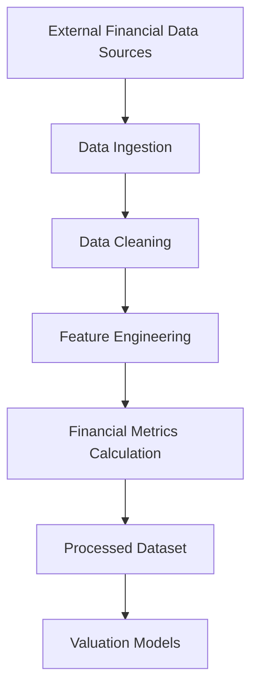
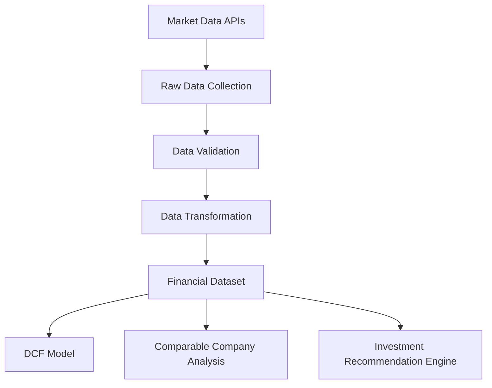
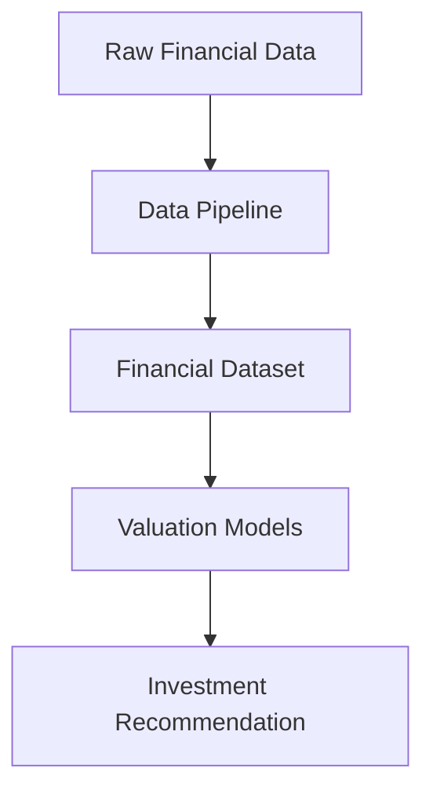

# Data Pipeline Module

Financial Data Ingestion and Processing for Equity Valuation

---

# Overview

The *data_pipeline module* provides the infrastructure for collecting, cleaning, and preparing financial data used throughout the valuation system.

Financial models depend on high-quality datasets including:

- financial statements
- market price data
- macroeconomic indicators
- peer company information

This module automates the process of *data ingestion, preprocessing, and transformation*, ensuring that downstream valuation models receive consistent and reliable inputs.

Within the overall system architecture, the data pipeline acts as the *data foundation layer*.

---

# Core Idea

Financial modeling requires structured datasets derived from multiple sources.

The data pipeline performs a sequence of steps:

1. Collect raw financial data from external sources
2. Clean and validate the data
3. Transform the data into structured datasets
4. Compute key financial metrics
5. Store processed datasets for modeling and analysis

Automating this workflow ensures that financial models can be *updated quickly when new data becomes available*. :contentReference[oaicite:1]{index=1}  

---

# Data Processing Workflow

---

# System Architecture

---

# Mathematical Foundations

## Revenue Growth

Revenue growth is computed as the percentage change in revenue between periods.

$$
Growth_t = \frac{Revenue_t - Revenue_{t-1}}{Revenue_{t-1}}
$$

Where:

- $Revenue_t$ = revenue in period $t$

---

## Profit Margin

Operating profit margin measures the profitability of company operations.

$$
Operating\ Margin = \frac{Operating\ Income}{Revenue}
$$

---

## Earnings Per Share

EPS represents the profit allocated to each outstanding share.

$$
EPS = \frac{Net\ Income}{Shares\ Outstanding}
$$

---

## Return on Equity

Return on equity measures how efficiently the company generates profit from shareholders’ equity.

$$
ROE = \frac{Net\ Income}{Shareholders' Equity}
$$

---

# Core Responsibilities

The **data pipeline module** performs the following functions.

---

### Data Ingestion

Collects financial data from external sources such as:

- financial statements
- market price datasets
- macroeconomic indicators

These datasets provide the *raw input for financial analysis*.

---

### Data Cleaning

Ensures dataset quality by:

- handling missing values
- removing inconsistencies
- standardizing data formats

Clean datasets are essential for reliable financial modeling.

---

### Data Transformation

Transforms raw financial data into structured formats suitable for analysis.

Examples include:

- aggregating financial statements
- aligning time-series data
- converting currencies or units

---

### Feature Engineering

Creates additional financial indicators such as:

- growth rates
- profitability ratios
- leverage metrics

These derived features improve the quality of downstream models.

---

### Data Storage

Stores processed datasets in a structured format for use by other modules, including:

- valuation models
- comparable company analysis
- simulation models

---

# Role in the Valuation System

The *data pipeline module* serves as the first stage of the equity research workflow.

By ensuring *consistent and reproducible datasets*, the data pipeline enables reliable financial modeling and investment analysis.

---

# Applications

This module supports several financial analysis tasks:

- equity research
- financial modeling
- investment analysis
- portfolio research
- CFA Research Challenge projects
