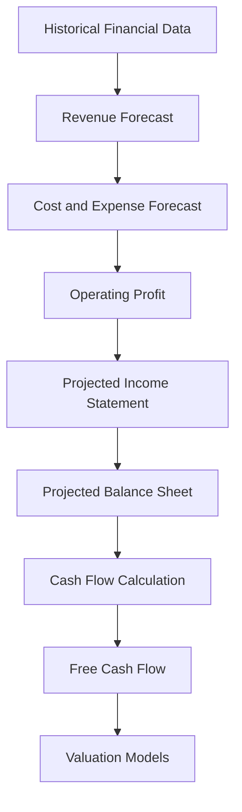
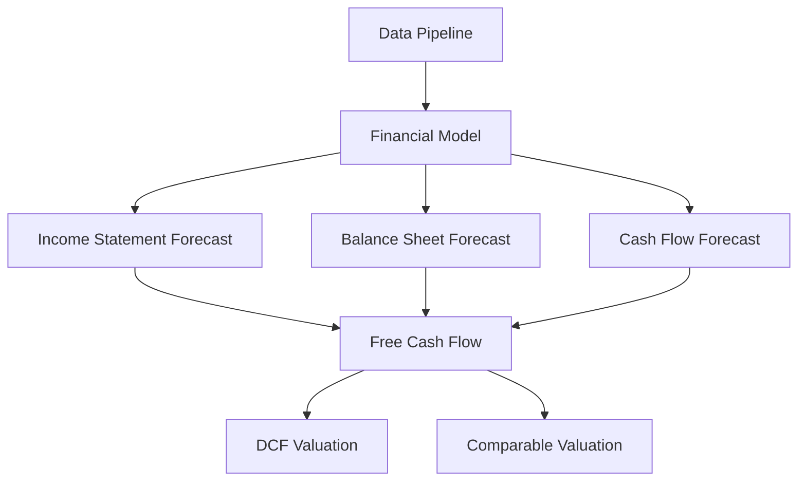
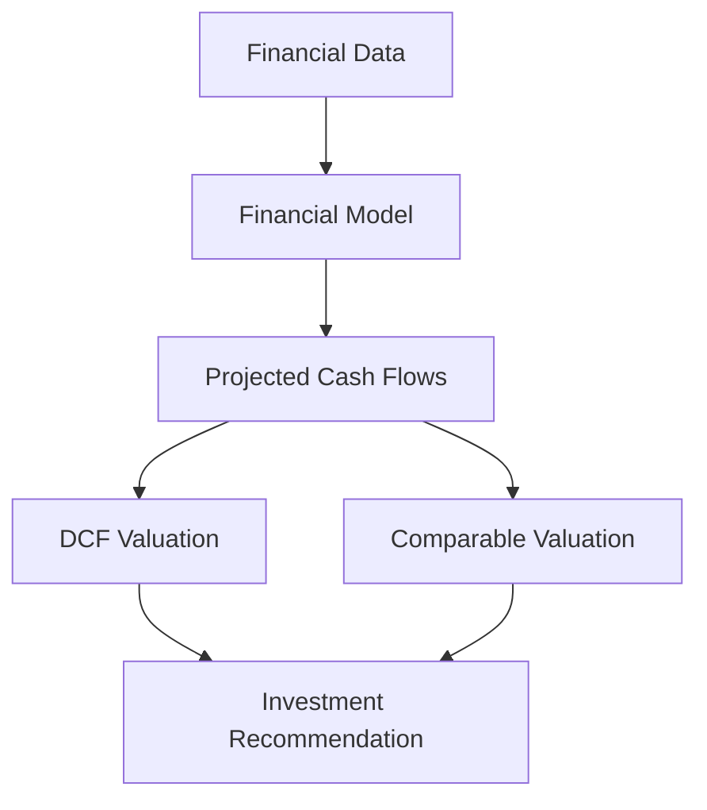

# Financial Modeling Module

Three-Statement Financial Model for Equity Valuation

---

# Overview

The *financial_model module* implements the core financial modeling engine used to forecast the future performance of a company.

Financial modeling is a fundamental step in equity valuation, where analysts construct *forecasted financial statements* based on historical data and economic assumptions. 

The module generates *pro-forma financial statements*, including:

- revenue forecasts
- operating expenses
- projected income statements
- balance sheet estimates
- cash flow projections

These forecasts provide the quantitative inputs required for valuation models such as *Discounted Cash Flow (DCF)* and *Comparable Company Analysis*.  

Financial statement modeling is widely used in investment analysis to translate assumptions about a company’s strategy, industry dynamics, and macroeconomic environment into numerical forecasts. :contentReference[oaicite:1]{index=1}  

---

# Core Idea

A financial model converts *business assumptions into financial projections*.

The modeling process generally follows these steps:

1. Analyze historical financial statements
2. Forecast future revenue growth
3. Estimate operating costs and margins
4. Project balance sheet components
5. Derive cash flows from projected statements
6. Use forecasts as inputs for valuation models

Analysts often start with *revenue forecasts*, since revenue growth is the primary driver of company performance. 

---

# Financial Modeling Workflow

---

# System Architecture

---

# Mathematical Foundations

## Revenue Forecast

Revenue forecasts are typically modeled using a growth assumption:

$$
Revenue_t = Revenue_{t-1} \times (1 + g)
$$

Where:

- $Revenue_t$ = revenue in year $t$
- $g$ = revenue growth rate

---

## Operating Income

Operating income represents profit generated from core business operations.

$$
Operating\ Income = Revenue - Operating\ Expenses
$$

---

## Operating Margin

Operating margin measures operating profitability.

$$
Operating\ Margin = \frac{Operating\ Income}{Revenue}
$$

---

## Net Income

Net income represents the total profit available to shareholders.

$$
Net\ Income = Revenue - Operating\ Expenses - Interest - Taxes
$$

---

## Free Cash Flow to Firm

Free Cash Flow represents the cash available to all investors.

$$
FCFF = EBIT(1 - T) + Depreciation - CapEx - \Delta WC
$$

Where:

- $EBIT$ = earnings before interest and taxes  
- $T$ = corporate tax rate  
- $CapEx$ = capital expenditures  
- $\Delta WC$ = change in working capital  

---

# Core Responsibilities

The *financial_model module* performs the following tasks.

---

### Historical Financial Analysis

Analyzes past financial statements to identify:

- revenue growth patterns
- cost structures
- profitability trends

These insights guide future forecasts.

---

### Revenue Forecasting

Projects future company revenue based on:

- historical growth trends
- market expansion
- industry outlook

Revenue forecasts serve as the *primary driver of the financial model*.

---

### Cost and Margin Forecasting

Estimates operating expenses and margins, including:

- cost of goods sold
- operating expenses
- depreciation

These forecasts determine future profitability.

---

### Financial Statement Projection

Generates projected financial statements including:

- income statement
- balance sheet
- cash flow statement

These statements must remain *internally consistent and balanced*.

---

### Cash Flow Calculation

Derives free cash flows from projected financial statements.

Free cash flows are used as inputs for valuation models such as:

- Discounted Cash Flow
- Comparable Company Analysis

---

# Role in the Valuation System

Within the full equity research pipeline, the *financial model acts as the forecasting engine*.

The quality of the financial model strongly influences the accuracy of the final valuation results.

---

# Applications

This module can be used for:

- equity research analysis
- CFA Research Challenge projects
- corporate valuation models
- financial modeling education
- investment decision support
