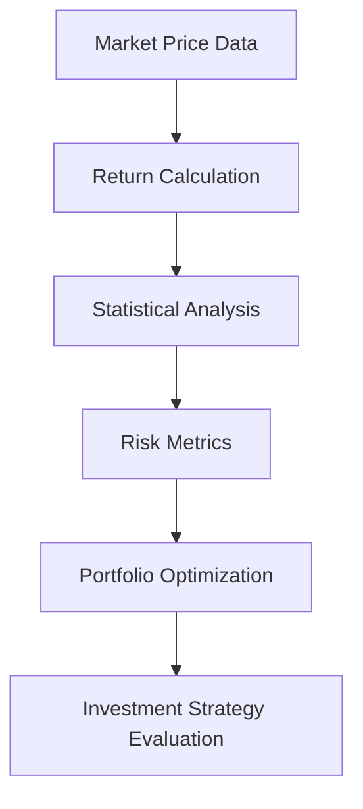
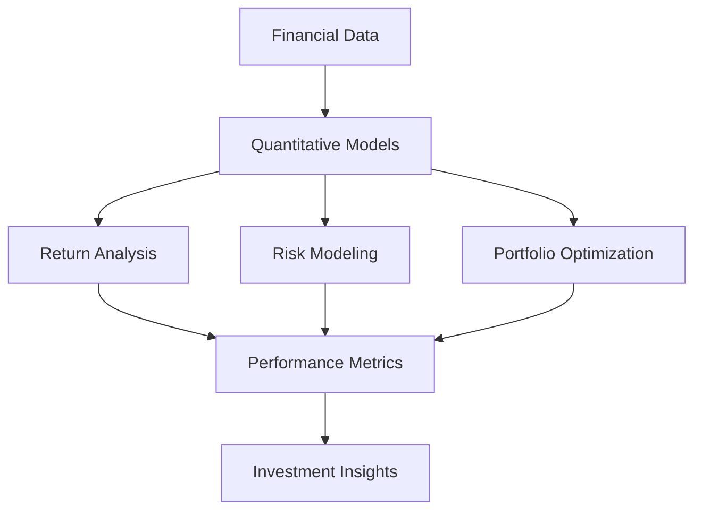
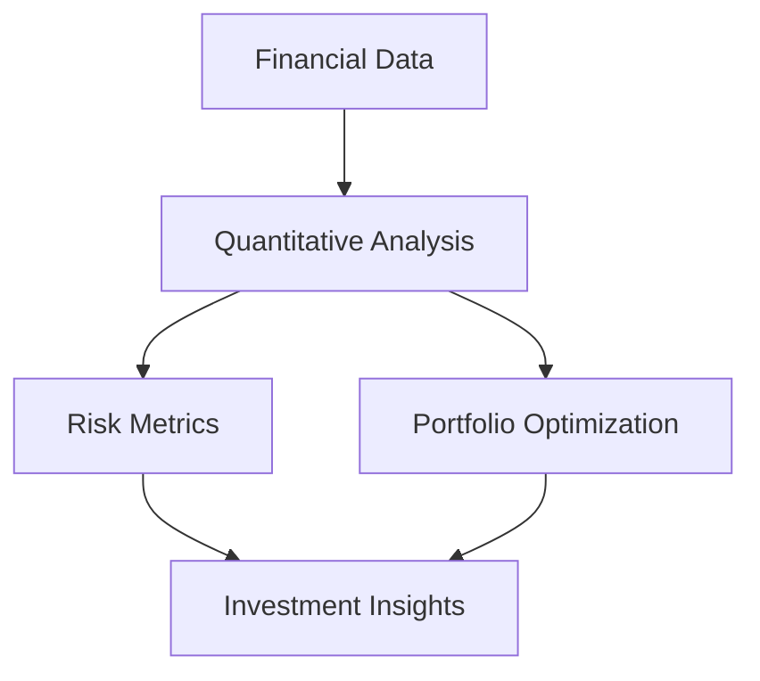

# Quantitative Analysis Module

Quantitative Finance Models for Risk, Return, and Portfolio Analysis

---

# Overview

The *quant module* implements quantitative finance techniques used to analyze financial markets and evaluate investment strategies.

Quantitative models use *mathematics, statistics, and computational methods* to model asset prices, estimate risk, and optimize investment decisions.

Within the overall CFA research system, this module provides the *analytical layer for statistical modeling and financial risk analysis*.

The module supports tasks such as:

- return modeling
- volatility estimation
- portfolio optimization
- risk metrics computation
- quantitative performance analysis

These methods enable analysts to make *data-driven investment decisions*.

---

# Core Idea

Financial markets exhibit randomness and uncertainty. Quantitative finance models represent this uncertainty using *probability theory and stochastic processes*.

The quant module performs the following steps:

1. Model asset returns using statistical distributions
2. Estimate expected return and volatility
3. compute covariance relationships between assets
4. evaluate portfolio risk and performance
5. optimize portfolio allocation

These models help determine the *optimal trade-off between risk and return*.

---

# Quantitative Analysis Workflow

---

# System Architecture

---

# Mathematical Foundations

## Asset Return

The return of an asset between two time periods is defined as:

$$
R_t = \frac{P_t - P_{t-1}}{P_{t-1}}
$$

Where:

- $P_t$ = asset price at time $t$
- $P_{t-1}$ = asset price at time $t-1$

Returns are the fundamental input for most quantitative financial models.

---

## Expected Return

The expected return of an asset is the average of historical returns.

$$
E[R] = \frac{1}{N} \sum_{i=1}^{N} R_i
$$

Where:

- $R_i$ = observed return
- $N$ = number of observations

---

## Volatility

Volatility measures the variability of asset returns.

$$
\sigma = \sqrt{\frac{1}{N-1} \sum_{i=1}^{N} (R_i - \mu)^2}
$$

Where:

- $\sigma$ = standard deviation of returns
- $\mu$ = mean return

Volatility is commonly used as a *proxy for financial risk*.

---

## Portfolio Expected Return

The expected return of a portfolio is the weighted average of individual asset returns.

$$
E[R_p] = \sum_{i=1}^{n} w_i E[R_i]
$$

Where:

- $w_i$ = weight of asset $i$
- $E[R_i]$ = expected return of asset $i$

---

## Portfolio Risk

Portfolio variance is given by:

$$
\sigma_p^2 = w^T \Sigma w
$$

Where:

- $w$ = vector of portfolio weights
- $\Sigma$ = covariance matrix of asset returns

This formulation is the basis of *Modern Portfolio Theory* introduced by Harry Markowitz. 

---

# Core Responsibilities

The *quant module* performs the following tasks.

---

### Return Modeling

Calculates historical returns and analyzes their statistical properties.

This includes:

- mean returns
- volatility estimates
- distribution analysis

---

### Risk Measurement

Computes financial risk metrics including:

- variance
- standard deviation
- covariance
- downside risk measures

These metrics quantify uncertainty in asset returns.

---

### Portfolio Optimization

Determines optimal asset allocation based on risk-return tradeoffs.

The objective is to find portfolio weights that:

- maximize expected return
- minimize portfolio risk

---

### Performance Analysis

Evaluates the performance of investment strategies using metrics such as:

- Sharpe ratio
- drawdown
- risk-adjusted return

---

# Role in the Valuation System

Within the overall research pipeline, the *quant module provides advanced analytical insights*.

These insights support *portfolio construction and investment strategy development*.

---

# Applications

This module can be used for:

- quantitative investment analysis
- portfolio optimization
- financial risk modeling
- statistical analysis of markets
- CFA research projects
