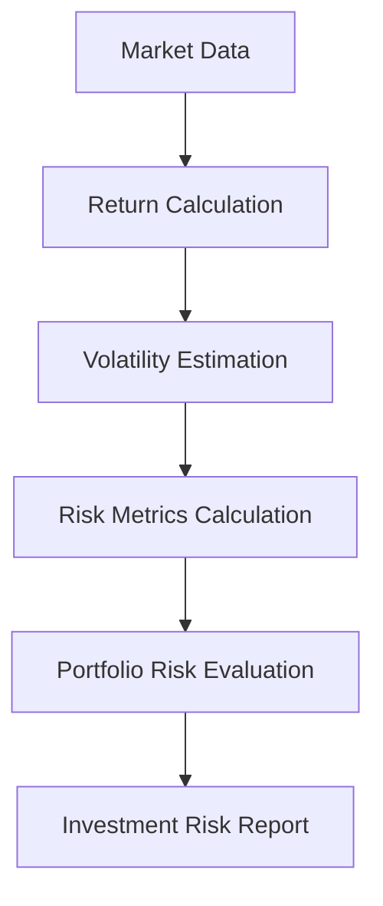
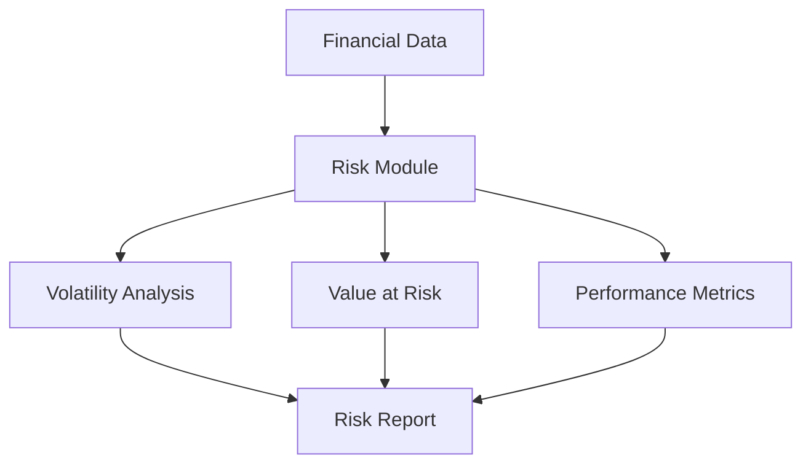
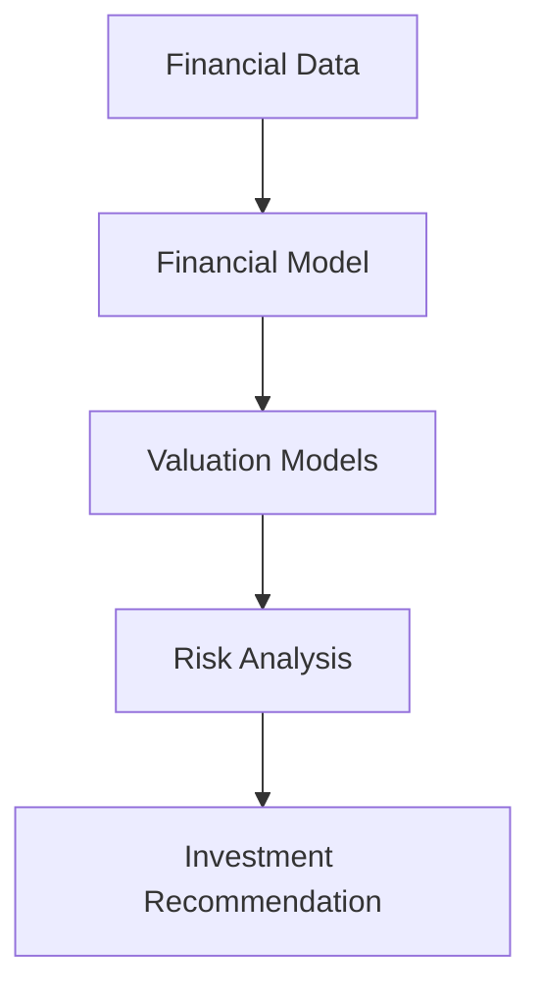

# Risk Analysis Module

Financial Risk Modeling and Portfolio Risk Assessment

---

# Overview

The *risk module* implements quantitative methods used to measure and analyze financial risk in investment portfolios.

Risk management is a critical component of investment analysis because it helps investors understand the potential losses associated with uncertain market conditions.

This module provides tools for:

- portfolio risk measurement
- volatility estimation
- risk-adjusted performance analysis
- downside risk evaluation
- investment risk monitoring

Within the overall valuation system, the risk module acts as the *risk evaluation layer*, ensuring that investment decisions consider both expected returns and potential losses.

---

# Core Idea

Financial markets are inherently uncertain. Investment returns fluctuate due to market volatility, macroeconomic conditions, and company-specific events.

Risk analysis aims to quantify this uncertainty using statistical and mathematical models.

The risk module performs the following steps:

1. Calculate historical asset returns
2. Estimate volatility and risk metrics
3. Measure portfolio risk exposure
4. Evaluate risk-adjusted performance
5. Identify potential downside scenarios

These metrics help investors make *balanced decisions between return and risk*.

---

# Risk Analysis Workflow

---

# System Architecture

---

# Mathematical Foundations

## Asset Return

The return of an asset between two time periods is:

$$
R_t = \frac{P_t - P_{t-1}}{P_{t-1}}
$$

Where:

- $P_t$ = asset price at time $t$
- $P_{t-1}$ = asset price at time $t-1$

Returns form the basis for most financial risk calculations.

---

## Volatility

Volatility measures the variability of asset returns.

$$
\sigma = \sqrt{\frac{1}{N-1}\sum_{i=1}^{N}(R_i - \mu)^2}
$$

Where:

- $\sigma$ = standard deviation of returns
- $\mu$ = mean return
- $R_i$ = individual return observations

Volatility is commonly used as a *proxy for financial risk*.

---

## Value at Risk (VaR)

Value at Risk estimates the maximum expected loss of a portfolio at a given confidence level.

$$
VaR = \mu + \sigma Z
$$

Where:

- $\mu$ = mean return
- $\sigma$ = return volatility
- $Z$ = standard normal quantile corresponding to the confidence level

VaR represents the *potential loss under normal market conditions*. 

---

## Sharpe Ratio

The Sharpe Ratio measures risk-adjusted investment performance.

$$
Sharpe = \frac{R_p - R_f}{\sigma_p}
$$

Where:

- $R_p$ = portfolio return
- $R_f$ = risk-free rate
- $\sigma_p$ = portfolio volatility

A higher Sharpe ratio indicates *better return relative to risk*. 

---

## Portfolio Beta

Beta measures the sensitivity of a portfolio to market movements.

$$
\beta = \frac{Cov(R_p, R_m)}{Var(R_m)}
$$

Where:

- $R_p$ = portfolio return
- $R_m$ = market return

Beta indicates how strongly the portfolio moves relative to the market.

---

# Core Responsibilities

The *risk module* performs several key functions.

---

### Return Analysis

Calculates asset and portfolio returns from market price data.

These returns are used as the basis for risk modeling.

---

### Volatility Estimation

Estimates the variability of asset returns using statistical techniques.

Volatility serves as a key measure of financial risk.

---

### Downside Risk Measurement

Evaluates potential losses using metrics such as:

- Value at Risk
- drawdown
- tail risk

These metrics help identify worst-case scenarios.

---

### Risk-Adjusted Performance

Measures investment performance relative to risk using metrics such as:

- Sharpe ratio
- alpha
- beta

These indicators help determine whether an investment provides adequate return for the risk taken.

---

# Role in the Valuation System

Within the overall research pipeline, the *risk module ensures that valuation decisions incorporate risk considerations*.

Risk analysis helps determine whether the expected return from an investment justifies the associated uncertainty.

---

# Applications

This module can be used for:

- investment risk analysis
- portfolio management
- quantitative finance research
- financial modeling
- CFA Research Challenge projects
