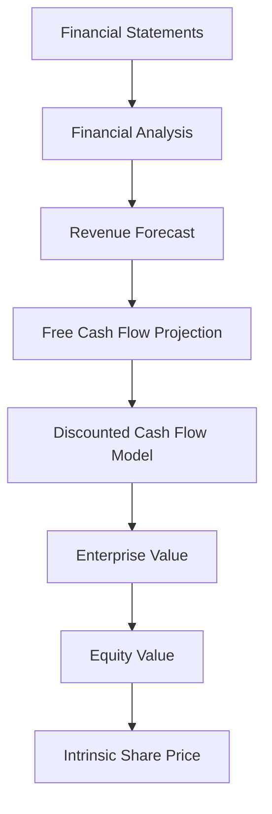
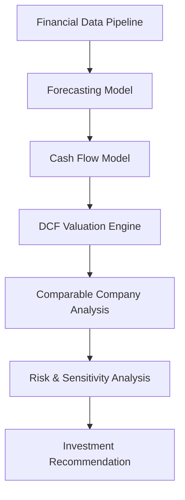

# Equity Valuation Module

Financial Valuation Framework for Investment Research and Equity Analysis

---

# Overview

The *valuation module* implements the core financial models used to estimate the *intrinsic value of a publicly traded company*.

It provides the computational framework required to transform *financial statement data, market assumptions, and growth forecasts* into a quantitative estimate of firm value.

Within the equity research system, this module serves as the *financial modeling engine*, integrating forecasting models with valuation techniques commonly used by professional analysts.

The module supports:

- Discounted Cash Flow (DCF) valuation  
- Comparable company analysis  
- Sensitivity analysis  
- Monte Carlo valuation simulation  

These tools allow analysts to assess whether a stock is *undervalued or overvalued relative to its intrinsic value*.

---

# Core Idea

Equity valuation attempts to determine the *true economic value of a company* based on its ability to generate future cash flows.

The valuation workflow follows several steps:

1. Analyze historical financial statements  
2. Forecast revenue, costs, and profitability  
3. Estimate future Free Cash Flow  
4. Discount future cash flows to present value  
5. Estimate terminal value  
6. Compare intrinsic value with market price  

If the intrinsic value exceeds the market price, the asset may represent an *investment opportunity*.

---

# Mathematical Formulation

## Free Cash Flow to Firm (FCFF)

The fundamental cash flow used in valuation is *Free Cash Flow to the Firm*:

FCFF = EBIT(1 − T) + Depreciation − CapEx − ΔWC

Where:

- EBIT = Earnings before interest and taxes  
- T = corporate tax rate  
- CapEx = capital expenditures  
- ΔWC = change in working capital  

FCFF represents the **cash available to all capital providers**.

---

## Discounted Cash Flow Model

The enterprise value of the firm is computed as the present value of future FCFF:

EV = Σ ( FCFF_t / (1 + WACC)^t ) + TV / (1 + WACC)^n

Where:

- EV = enterprise value  
- WACC = weighted average cost of capital  
- TV = terminal value  

This represents the *intrinsic value of the firm’s operating assets*.

---

## Weighted Average Cost of Capital

The discount rate used in the DCF model is the *Weighted Average Cost of Capital*:

WACC = (E / (D + E)) * Re + (D / (D + E)) * Rd * (1 − T)

Where:

- E = market value of equity  
- D = market value of debt  
- Re = cost of equity  
- Rd = cost of debt  

WACC represents the *required return demanded by investors*.

---

## Terminal Value

Because companies operate indefinitely, a terminal value captures cash flows beyond the forecast period.

Using the *Gordon Growth Model*:

TV = FCFF_(n+1) / (WACC − g)

Where:

- g = perpetual growth rate  

Terminal value typically represents a *large portion of total firm value*.

---

## Equity Value

After computing enterprise value, the equity value is derived as:

Equity Value = Enterprise Value − Net Debt

Where:

Net Debt = Total Debt − Cash

Finally, the *intrinsic share price* is:

Price = Equity Value / Shares Outstanding

---

# Valuation Pipeline

Valuation System Architecture

---

# Comparable Company Valuation

In addition to intrinsic valuation, analysts evaluate firms using *relative valuation multiples*.

Common multiples include:

- Price to Earnings (P/E)  
- Enterprise Value to EBITDA (EV/EBITDA)  
- Enterprise Value to Sales (EV/Sales)  

The valuation estimate is:

Value = Metric × Peer Multiple

Where:

- Metric = company financial metric  
- Peer Multiple = industry average multiple  

This approach provides a *market-based benchmark valuation*.

---

# Monte Carlo Valuation Simulation

Financial valuation involves uncertainty in:

- growth rates  
- discount rates  
- profit margins  

Monte Carlo simulation models these uncertainties by sampling from probability distributions.

For each simulation:

1. Randomly sample growth rate  
2. Randomly sample WACC  
3. Recompute firm valuation  

This produces a *distribution of possible valuations*, allowing analysts to estimate:

- downside risk  
- expected valuation range  

---

# Investment Decision Rule

The final step compares intrinsic value with the market price.

Upside = (Intrinsic Value − Market Price) / Market Price

Investment decisions may follow rules such as:

| Upside | Recommendation |
|------|------|
| > 25% | Strong Buy |
| 10–25% | Buy |
| -10% to 10% | Hold |
| < -10% | Sell |

---

# Module Responsibilities

The *valuation module* performs the following functions.

---

### Financial Forecasting

Generates projections for:

- revenue growth  
- operating margins  
- capital expenditures  
- working capital  

These projections form the foundation of the valuation model.

---

### Cash Flow Modeling

Calculates the *Free Cash Flow to Firm* for each forecast period.

This step converts accounting data into *economic cash flows*.

---

### Intrinsic Valuation

Implements the *Discounted Cash Flow model* to estimate enterprise value.

The valuation reflects the company’s *long-term cash generation potential*.

---

### Relative Valuation

Compares the firm against its industry peers using valuation multiples.

This provides a *market-based valuation reference*.

---

### Risk Analysis

Performs sensitivity analysis and Monte Carlo simulation to assess valuation uncertainty.

This helps analysts understand *how sensitive the valuation is to assumptions*.

---

### Investment Recommendation

Combines valuation results with the current market price to generate an *automated investment signal*.

---

# Final Output

The module produces:

- enterprise value  
- equity value  
- intrinsic share price  
- valuation sensitivity analysis  
- comparable valuation estimates  
- automated investment recommendation
